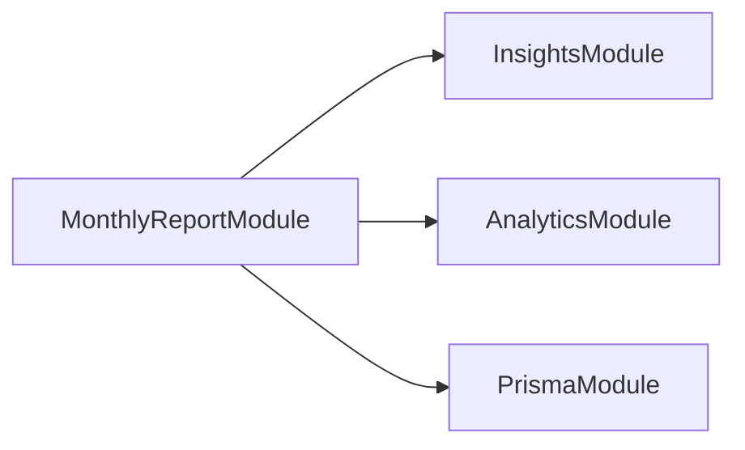
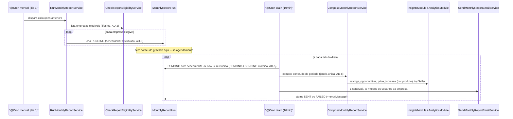
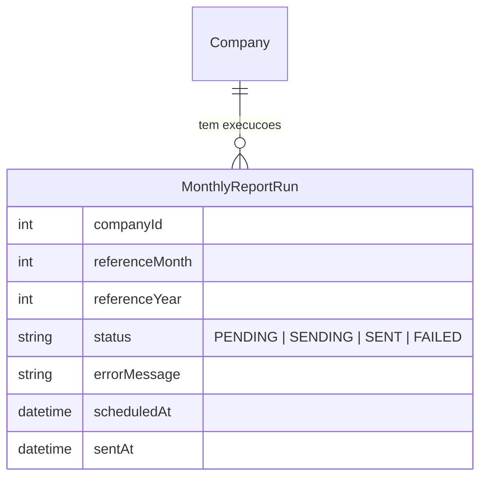

# Architecture Spine — monthly-report

## Design Paradigm

Pipeline orquestrado: um coordinator (`RunMonthlyReportService`) chama estágios em sequência — **Elegibilidade → Composição → Renderização → Envio → Registro** — cada estágio um service de responsabilidade única. É a continuação natural do estilo que o resto do projeto já usa (`GetBestSupplierService`, `CreateInvoiceService`, um verbo por classe), sem introduzir uma camada de ports/adapters formal.

Mapeamento: cada estágio vive em `src/v1/modules/monthly-report/services/`; o coordinator e os dois `@Cron` (disparo mensal + drain) vivem no mesmo módulo. Nenhum estágio contém lógica de comparação de preço/fornecedor — essa lógica continua morando só em `insights`/`analytics` (ver AD-2).

## Invariants & Rules

### AD-1 — Fronteira de módulo via imports/exports do Nest

- **Binds:** `monthly-report`, `insights`, `analytics`, `prisma` (module), e qualquer módulo futuro que consuma services de outro módulo
- **Prevents:** dois módulos registrando o mesmo provider de formas incompatíveis (hoje `InsightsModule` redeclara `ExpensesService`/`AnalyticsRepository`/`PrismaService` como providers próprios em vez de importar `AnalyticsModule`/`PrismaModule` — funciona só porque esses services ainda são stateless; deixa de ser garantia no dia em que algum ganhar estado)
- **Rule:** todo módulo que expõe um service para consumo externo declara `exports: [...]`; todo módulo consumidor usa `imports: [XModule]` — nunca redeclara o provider como seu. `InsightsModule` e `AnalyticsModule` ganham `exports` para os services que `monthly-report` consome (`GetSavingsOpportunitiesService`, `GetProductPriceIncreaseService`, `SuppliersService`). `monthly-report` importa `PrismaModule` (já existe, hoje sem uso) em vez de declarar `PrismaService` como provider próprio.
- Retrofitar os módulos existentes que já violam essa regra é decisão separada — ver Deferred.

Diagrama mostra só as arestas que esta feature de fato cria. `InsightsModule`/`AnalyticsModule` continuam, por ora, redeclarando `PrismaService`/providers uns dos outros por baixo do padrão antigo (ver Deferred) — não é retratado aqui pra não confundir "o que existe" com "o que essa spine corrige".



### AD-2 — Nenhuma lógica de negócio de insight duplicada no monthly-report

- **Binds:** FR-2, FR-3, FR-4
- **Prevents:** o relatório mensal e o endpoint HTTP ao vivo (`/insights/*`, `/analytics/*`) divergindo silenciosamente sobre o que conta como "oportunidade de economia" ou "aumento de preço"
- **Rule:** `monthly-report` só orquestra chamadas a `GetSavingsOpportunitiesService`, `GetProductPriceIncreaseService` e `SuppliersService.getTopSellerSuppliers` — nunca reimplementa comparação de preço/fornecedor. Toda lógica de comparação continua em `insights`/`analytics`. Exceção deliberada: a query de **elegibilidade** (FR-1) é lifetime (sem filtro de período) por definição do próprio FR-1 — não reaproveita a janela de período de AD-3/AD-4/AD-8 nem deve ser confundida com elas.

### AD-3 — `GetSavingsOpportunitiesService` ganha escopo de período opcional

- **Binds:** FR-2
- **Prevents:** o relatório citar uma "oportunidade do período" que na verdade veio da última compra registrada, meses antes do período anunciado no e-mail
- **Rule:** `getSavingsOpportunities(companyId, month?, year?)` — quando `month`/`year` são passados, a busca de compra mais recente por produto (hoje `findLatestPurchasePerProduct`) fica limitada à janela desse mês; omitidos, preserva o comportamento atual (compra mais recente, sem limite — `/insights/savings_opportunities` ao vivo não muda). `monthly-report` sempre passa o mês de referência explícito (mês anterior completo), calculado pelo helper único de AD-8.

### AD-4 — Alertas de aumento de preço são compostos por produto, no monthly-report — e `findPurchaseHistoryByProduct` precisa de fato respeitar o período

- **Binds:** FR-3
- **Prevents:** duplicar dentro de `insights` uma segunda forma de "todos os alertas de uma empresa" quando o padrão de loop-por-produto já existe (`GetSavingsOpportunitiesService` já faz isso internamente); e reportar um "aumento do período" que na verdade veio de um histórico sem corte de data
- **Correção encontrada na Reviewer Gate:** `GetProductPriceIncreaseService.getProductPriceIncrease` recebe `month`/`year` via `FiltersDto`, mas `InsightsRepository.findPurchaseHistoryByProduct` **ignora esses dois campos** — busca o histórico inteiro do produto, sem corte de data. A suposição original desta AD ("já aceita período, nenhuma mudança necessária") estava errada; `insights` precisa de uma mudança real, simétrica à de AD-3.
- **Rule:** `findPurchaseHistoryByProduct(params, companyId)` passa a aplicar `invoice.issuedAt: { lte: endOfReferenceMonth }` quando `params.month`/`year` são passados (sem limite inferior — a média histórica continua olhando todo o passado antes do corte); omitidos, preserva o comportamento atual (`/insights/product_history` ao vivo não muda). `monthly-report` levanta os `productId` distintos comprados pela empresa na janela do período de referência (query nova, própria de `monthly-report`, lifetime→period-bound conforme AD-8 — não pertence a `insights`) e chama `getProductPriceIncrease({ month, year, productId }, companyId)` uma vez por produto, mantendo só as entradas com `alert === true`.
- **Segunda correção, encontrada no `code-review` após a implementação (não pega pela Reviewer Gate nem pela primeira correção acima):** o corte só-superior em `findPurchaseHistoryByProduct` resolve "não usar compra futura", mas não resolve um fornecedor do mesmo produto que simplesmente **não comprou no mês de referência** — sua última compra (de meses atrás) ainda vira "current" por ser a mais recente ≤ corte, podendo gerar `alert: true` sobre uma mudança de preço antiga, repetida em todo relatório seguinte até ele comprar de novo. Fix: `GetProductPriceIncreaseService.getProductPriceIncrease` agora, quando `month`/`year` são passados, só inclui um fornecedor no resultado se a `issuedAt` da compra "current" cair dentro da janela completa do mês de referência (não só antes do corte) — usa o mesmo `getReferenceMonthWindow` de AD-8.

### AD-5 — Persistência de execução garante idempotência e auditoria (por empresa, um envio, um destinatário-lista)

- **Binds:** FR-6, SM-3
- **Prevents:** reenviar o mesmo relatório duas vezes se o job rodar mais de uma vez no mesmo ciclo (deploy, restart, retry manual, dois ticks do drain se sobrepondo); falha de envio invisível; ambiguidade sobre "o que é uma linha" quando a empresa tem vários usuários
- **Rule:** uma linha `MonthlyReportRun` por `(companyId, referenceMonth, referenceYear)` — **não** por usuário — com `@@unique([companyId, referenceMonth, referenceYear])`. O envio de uma empresa é **uma única chamada `sendMail`** com todos os e-mails dos usuários daquela empresa no campo `to`; a linha reflete esse envio único (nodemailer reporta `accepted`/`rejected` por endereço — guardados em `errorMessage` se houver rejeição parcial, mas isso não gera FAILED se ao menos 1 endereço foi aceito). Status: `PENDING → SENDING → SENT | FAILED`. A transição `PENDING → SENDING` é uma escrita condicional (`updateMany` com `where: { status: 'PENDING' }`, checando a contagem afetada) feita pelo drain **antes** de compor/enviar — é essa escrita atômica, não o valor de `scheduledAt`, que impede dois ticks do drain sobrepostos (ou duas instâncias do processo) enviarem a mesma empresa duas vezes. O job mensal só cria linhas `PENDING`; nunca reenvia uma empresa já `SENT` para aquele ciclo.

### AD-6 — Distribuição de envio sem infraestrutura nova

- **Binds:** NFR de FR-6 (>250 e-mails/ciclo, teto de 300/dia do Brevo)
- **Prevents:** estourar o limite diário do Brevo disparando tudo de uma vez **ou** estourá-lo mesmo distribuindo, se o total do ciclo passar de 300 (distribuir dentro de um único dia não ajuda se o volume do dia já excede o teto do dia); também previne introduzir Redis/fila dedicada antes de haver volume que justifique
- **Rule:** o `@Cron` mensal (dia 1) calcula os elegíveis e cria as linhas `MonthlyReportRun` em `PENDING`. Se o total de envios do ciclo (1 envio = 1 empresa, ver AD-5) passar de 250, distribui `scheduledAt` ao longo de **quantos dias forem necessários** para manter cada dia com no máximo ~280 envios (margem de segurança sobre o teto de 300) — não só ao longo de um único dia; abaixo de 250, `scheduledAt = now()`. Um segundo `@Cron` de intervalo curto ("drain", ex.: a cada 10 min) busca `PENDING` com `scheduledAt <= now()`, reivindica atomicamente (AD-5), compõe, renderiza e envia. **Composição e renderização acontecem aqui no drain, não no cron mensal** — o cron mensal só decide elegibilidade e agenda, nunca gera conteúdo (ver diagrama de sequência). `ScheduleModule.forRoot()` precisa ser importado em `AppModule` para os dois `@Cron` funcionarem — sem isso, `RunMonthlyReportService` compila mas nenhum dos dois jobs dispara. Nenhuma fila externa (BullMQ/Redis) é introduzida nesta iteração.

### AD-7 — Falha isolada por empresa

- **Binds:** FR-6
- **Prevents:** uma exceção ao compor/renderizar/enviar o relatório de uma empresa derrubar o ciclo inteiro (as outras empresas não recebendo por causa de uma só)
- **Rule:** o processamento de cada empresa (composição → render → envio, dentro do drain) é envolvido em um `try/catch` no nível do coordinator; uma exceção ali marca a `MonthlyReportRun` daquela empresa como `FAILED` com `errorMessage`, loga via `Logger`, e o loop segue para a próxima empresa. Nenhuma exceção de uma empresa individual propaga para fora do coordinator.

### AD-8 — Janela do mês de referência calculada por um único helper compartilhado

- **Binds:** FR-2, FR-3, FR-5
- **Prevents:** cada call site calculando "o mês de referência" à sua própria maneira e discordando na borda (o código já tem pelo menos um cálculo próprio — `GetBestSupplierService.getDateWindow` — e esta feature adicionaria mais dois independentes em AD-3/AD-4 se não for contido agora). Não se aplica à elegibilidade (FR-1) — essa é lifetime por definição (AD-2) e não usa janela nenhuma.
- **Rule:** uma única função (`getReferenceMonthWindow(month, year)`) retorna `{ start, end }` e é a **única** fonte da janela do mês de referência usada pelas chamadas que AD-3 e AD-4 fazem — nenhuma delas recalcula a janela por conta própria. **Correção encontrada na implementação da Story 1.2** (não na Reviewer Gate): a primeira versão desta AD colocava a função em `monthly-report`, mas quem precisa calculá-la de fato é o próprio *repository* de `insights` (dentro de `findLatestPurchasePerProduct` e `findPurchaseHistoryByProduct`, AD-3/AD-4) — e `insights` não pode depender de `monthly-report` sem inverter a direção que a própria AD-1 fixou. A função vive em `insights/utils/get-reference-month-window.ts`; `monthly-report` a importa diretamente por caminho relativo pra sua própria query de produtos comprados no período (AD-4/Story 1.3) — é um import de arquivo puro (sem estado, não é um provider do Nest), não passa pelo `imports`/`exports` de módulo da AD-1, mesmo padrão que `FiltersDto` já usa hoje entre `analytics` e `insights`. A query de elegibilidade (FR-1) não é consumidora desta função (AD-2). Timezone: local do servidor, igual à convenção já existente em `getDateWindow` — esta spine não introduz uma política de timezone nova (ex.: UTC) só para esta feature; unificar o projeto todo em UTC é um retrofit maior, fora do escopo aqui (ver Deferred).

## Consistency Conventions

| Concern | Convention |
| --- | --- |
| Naming (entities, files, interfaces, events) | Módulo `monthly-report`; classes por verbo (`RunMonthlyReportService`, `CheckReportEligibilityService`, `ComposeMonthlyReportService`, `RenderMonthlyReportEmailService`, `SendMonthlyReportEmailService`), igual ao resto do projeto. Model Prisma `MonthlyReportRun`. |
| Data & formats (ids, dates, error shapes, envelopes) | Período de referência sempre como par explícito `(month: number 1-12, year: number)`, nunca um `Date`/range cru entre módulos — mesma forma que `FiltersDto` já usa. `errorMessage: string` livre (sem shape estruturado — consistente com o resto do projeto, que ainda não define um formato de erro comum). |
| State & cross-cutting (mutation, errors, logging, config, auth) | Fronteira de módulo via `imports`/`exports` (AD-1). Erro por empresa nunca escapa do coordinator (AD-7). Credenciais SMTP do Brevo e o cron expression do disparo mensal via `ConfigService`/`.env`, mesmo padrão já usado para o segredo do JWT. Sem `@UseGuards`/`CurrentUser` no monthly-report — o coordinator itera empresas diretamente via Prisma, fora de contexto HTTP. |
| Valores monetários (Compose → Render) | Sempre `number` já arredondado a 2 casas (`Number(x.toFixed(2))`), igual ao padrão já usado em `GetSavingsOpportunitiesService`. `ComposeMonthlyReportService` nunca entrega `Decimal` do Prisma nem string formatada; formatação de moeda (`R$`) é responsabilidade só do `RenderMonthlyReportEmailService`. |

## Stack

| Name | Version |
| --- | --- |
| @nestjs/schedule | ^6.1.3 (não ^12.x). **Correção encontrada só na implementação da Story 2.1**, não em nenhuma revisão anterior: a partir da 12.0.0 o pacote virou ESM puro (`"type": "module"`) pra acompanhar o Nest 12 — quebra o Jest deste projeto (`ts-jest`, CommonJS, sem config de ESM) com `SyntaxError: Unexpected token 'export'`. A verificação de peerDependencies feita na Architecture checou compatibilidade de versão, mas não formato de módulo nem a cadeia de teste real — só rodar a suíte revelou o problema. `6.1.3` é a última versão antes desse salto (o pacote pulou de `6.1.3` direto pra `12.0.0`), é CJS, e suas peerDependencies (`@nestjs/common`/`core` ^10\|\|^11) batem exatamente com o Nest 11 do projeto, sem nem reivindicar Nest 12) |
| nodemailer | ^10.0.10 (transporte SMTP para Brevo; requer Node ≥20 — **projeto não tem `engines` no `package.json`, `.nvmrc` nem Dockerfile fixando isso hoje**; adicionar `engines.node: ">=20"` faz parte desta feature, não é suposição segura. v10 é recém-lançado — 10 patches nos primeiros 11 dias — risco de instabilidade a observar, não motivo pra trocar de decisão) |
| Brevo (SMTP) | plano gratuito, 300 e-mails/dia, remetente individual verificado (decisão já tomada no addendum do PRD) |

## Structural Seed

```text
src/v1/modules/monthly-report/
  monthly-report.module.ts        # imports: InsightsModule, AnalyticsModule, PrismaModule, ConfigModule
  services/
    run-monthly-report.service.ts        # coordinator: @Cron mensal (dia 1, so agenda) + @Cron drain (compoe/renderiza/envia)
    check-report-eligibility.service.ts  # FR-1: >=1 produto em 2+ notas distintas, lifetime (AD-2)
    compose-monthly-report.service.ts    # chama insights/analytics para a janela do periodo (AD-2, AD-3, AD-4)
    render-monthly-report-email.service.ts  # conteúdo -> HTML/texto do e-mail
    send-monthly-report-email.service.ts    # nodemailer + Brevo SMTP, 1 sendMail por empresa (AD-5)
  repositories/
    monthly-report.repository.ts    # leitura: empresas+usuários, produtos comprados no período (AD-4); escrita: MonthlyReportRun (AD-5)

# Único arquivo novo dentro de insights/ nesta feature (AD-8) -- fica lá, não
# em monthly-report, porque o próprio repository de insights precisa dele:
src/v1/modules/insights/utils/get-reference-month-window.ts

# AppModule precisa de ScheduleModule.forRoot() nos imports (AD-6) -- sem isso os @Cron nao disparam.
```





## Capability → Architecture Map

| Capability / Area | Lives in | Governed by |
| --- | --- | --- |
| FR-1 Elegibilidade (lifetime, sem filtro de período) | `monthly-report/repositories` (query nova) | AD-2 |
| FR-2 Oportunidades de Economia | `insights` (`GetSavingsOpportunitiesService` estendido) + `monthly-report` (orquestra) | AD-2, AD-3, AD-8 |
| FR-3 Alertas de Aumento de Preço | `insights` (`GetProductPriceIncreaseService` sem mudança de assinatura, `InsightsRepository.findPurchaseHistoryByProduct` corrigido) + `monthly-report` (loop por produto) | AD-2, AD-4, AD-8 |
| FR-4 Situação Normal / Fornecedor principal | `analytics` (`SuppliersService.getTopSellerSuppliers`, sem mudança) + `monthly-report` (compose/render) | AD-2 |
| FR-5 Agendamento | `monthly-report` (`RunMonthlyReportService`, `@nestjs/schedule`, `ScheduleModule.forRoot()` em `AppModule`) | AD-6, AD-8 |
| FR-6 Envio + auditoria | `monthly-report` (`SendMonthlyReportEmailService`, `MonthlyReportRun`) | AD-5, AD-6, AD-7 |

## Deferred

- **Canal WhatsApp** e **limiar de concentração configurável** — Non-Goals explícitos do PRD (§5); nada aqui os antecipa.
- **Monitoramento proativo de falha recorrente por empresa (PRD OQ8)** — o schema de `MonthlyReportRun` já dá base para consultar "empresa falhando há N ciclos", mas nenhum alerta é construído agora.
- **Fila dedicada (BullMQ/Redis)** — revisitar a distribuição de envio (AD-6) se/quando empresas × usuários elegíveis se aproximar consistentemente do teto de 300/dia do Brevo; até lá, a tabela + drain cron basta.
- **Retrofit dos módulos existentes** (`invoice`, `auth`, `analytics`, `insights`) para importar `PrismaModule` em vez de redeclarar `PrismaService` — inconsistência real encontrada durante esta spine (múltiplas instâncias de `PrismaClient`/pool de conexão hoje), mas fora do escopo desta feature. `monthly-report` já nasce correto (AD-1); o retrofit dos módulos antigos é um item de limpeza separado.
- **Ambiente de deploy/produção** — o projeto ainda não tem Dockerfile, CI ou hospedagem definida (nenhum arquivo de deploy no repo). `@nestjs/schedule` exige um processo Node de vida longa — não funciona em plataforma serverless/função efêmera. Esta spine assume que a aplicação roda como processo long-lived; se a hospedagem escolhida no futuro for serverless, o mecanismo de agendamento (AD-6) precisa ser revisitado. Escolha de hospedagem é decisão de plataforma, fora do escopo desta feature.
- **Endpoint/trigger manual para teste (SM-2)** — o PRD pede mostrar o conteúdo pra alguém fora do projeto antes de validar; nenhum mecanismo de preview/disparo manual foi especificado aqui. Decidir na quebra em stories (pode ser um script, um endpoint interno guardado por `JwtAuthGuard`, ou só rodar o job localmente) — **mas qualquer que seja, tem que reusar o mesmo caminho de escrita em `MonthlyReportRun` de AD-5 (upsert + transição atômica)**, nunca enviar por fora dele, senão quebra a idempotência que AD-5 garante.
- **Motor de template do e-mail (string simples vs. handlebars/ejs/react-email)** — detalhe de implementação de `RenderMonthlyReportEmailService`, não muda nenhum invariante; decidir na story.
- **Timezone único (UTC) pro projeto todo** — AD-8 conserta a divergência *entre os call sites desta feature*, mas herda o timezone local de servidor que `GetBestSupplierService.getDateWindow` já usa hoje. Migrar o projeto inteiro pra UTC (ou fixar o timezone do servidor explicitamente) é um retrofit maior que atravessa módulos que esta feature não toca — fica pra depois.
